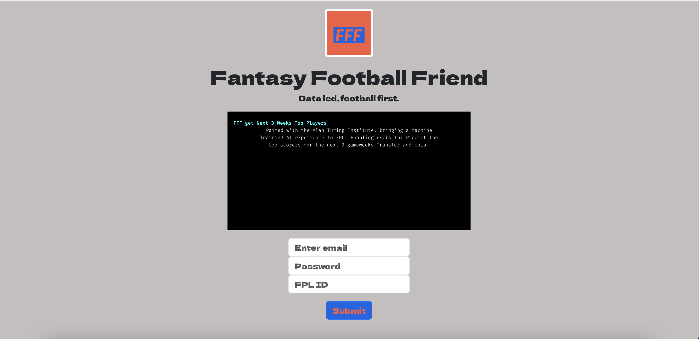

# AIrsenal


*AIrsenal* is a package for using Machine learning to pick a Fantasy Premier League team.
Airsenal is a powerful tool designed to streamline and enhance your fantasy football management experience. With Airsenal, users can optimize their fantasy football team selections and strategies, gaining an edge over their competition. This Airsenal project allows the user to interact with the Airsenal machine learning tool to get the best trasnfers in and out for the next three game weeks, allowing a detailed view of your starting 11 and recommended transfers in and out. This README provides an overview of the application's features, installation instructions, and usage guidelines.

### Demo 


Features
Optimization: Airsenal provides advanced optimization algorithms to help users select the best possible lineup based on various factors such as player statistics, fixture difficulty, and budget constraints.
Integration: Seamlessly integrate Airsenal with popular Fantasy Premier League to import and export team data, making it easy to incorporate optimized lineups into your existing fantasy team management workflow. 
Customization: Tailor optimization settings to match your specific league format, scoring rules, and personal preferences, ensuring accurate and personalized lineup suggestions.
Automation: Set up scheduled optimizations to automatically update your fantasy team lineup at specified intervals, saving time and effort while ensuring your team remains competitive throughout the season.
Performance Insights: Gain valuable insights into player performance trends, injury updates, and upcoming fixtures to make informed decisions and stay ahead of the competition.
For some background information and details see https://www.turing.ac.uk/research/research-programmes/research-engineering/programme-articles/airsenal.

We welcome contributions and comments - if you'd like to join the AIrsenal community please refer to our [contribution guidelines](https://github.com/alan-turing-institute/AIrsenal/blob/master/CONTRIBUTING.md)

You will need Docker Desktop installed to run this application: https://www.docker.com/products/docker-desktop/

```shell
git clone https://github.com/alan-turing-institute/AIrsenal.git
pip install .
poetry install 
```

### Docker

Build the docker-image:

```console
$ docker build -t airsenal .
```

If `docker build` fails due to a `RuntimeError` like

```console
Unable to find installation candidates for jaxlib (0.4.11)
```

this may be a lack of maintained versions of a package for `m1` on Linux.

A slow solution for this error is to force a `linux/amd64` build like

```console
$ docker build --platform linux/amd64 -t airsenal .
```

If that fails try

```console
$ docker build --platform linux/amd64 --no-cache -t airsenal .
```

See ticket [#547](https://github.com/alan-turing-institute/AIrsenal/issues/574) for latest on this issue.

Create a volume for data persistance:

```console
$ docker volume create airsenal_data
```

Open New terminal to Express server and make it ready to run.
```console
$ cd airsenal 
$ cd scripts to work
$ docker run --rm -v airsenal_data:/tmp -e "FPL_TEAM_ID=3705355" -e "AIRSENAL_HOME=/tmp" airsenal poetry run airsenal_run_prediction --weeks_ahead 3 > output_predictions.log 2>&
$ node server.js 
```

Open New terminal to start front end
```console
$ cd fpl-front-end 
$ yarn
$ yarn start 
```

Open browser at 3001, you will now be able to input your own FPL login details or if you do not have login details use the details below and it will be able to do a basic return using my ID! Please check out some of the error handling I have added. 
Email: any fake email 
Password: Any that is long enough
FPL: 3705355


Usage
Once Airsenal is set up and running, follow these steps to optimize your fantasy football team:

Access the Airsenal web interface or API endpoints.
Input your fantasy team details, including player information, fixture data, and budget constraints.
Configure optimization settings such as desired formation, captaincy options, and transfer strategies.
Initiate the optimization process and wait for Airsenal to generate optimized lineup suggestions.
Review the recommended lineup and make any necessary adjustments based on personal preferences or additional insights.
Export the optimized lineup to your fantasy football platform or manually update your team roster.

Difficulties Encountered
Integration Issues with Typewriter Effect: Initially, integrating the Typewriter Effect library posed challenges, particularly in synchronizing its behavior with other components.

Error Handling with Express.js: Implementing robust error handling mechanisms in Express.js, especially when dealing with asynchronous operations, required careful consideration and testing.

Deployment Configuration: Configuring the deployment process, particularly with Serverless Framework, took time to fine-tune and ensure smooth deployment to AWS Lambda.

Successes Achieved
Integration of Typewriter Effect: Overcame initial integration issues with Typewriter Effect and successfully incorporated it into the project, enhancing the user experience.

Effective Error Handling: Implemented comprehensive error handling strategies in Express.js, ensuring better resilience and user feedback in case of errors.

Seamless Deployment: Configured seamless deployment using Serverless Framework, simplifying the deployment process and ensuring the project's availability on AWS Lambda.

Lessons Learned
Persistence Pays Off: The project highlighted the importance of persistence in troubleshooting and problem-solving, particularly when integrating third-party libraries and configuring deployment pipelines.

Test-Driven Development (TDD) is Essential: Adopting a test-driven development approach early in the project lifecycle helps identify and address potential issues sooner, leading to more robust and reliable software.

Documentation is Key: Comprehensive documentation, both for code and project setup, proved invaluable in understanding and maintaining the project over time.

Next Steps
Moving forward, the project aims to deploy on heroku using the api endpoints used currently in the docker container. The Airsenal backend code requires major upheaval, which is both daunting and exciting. I would love to explain where I currently am with this development to you. 